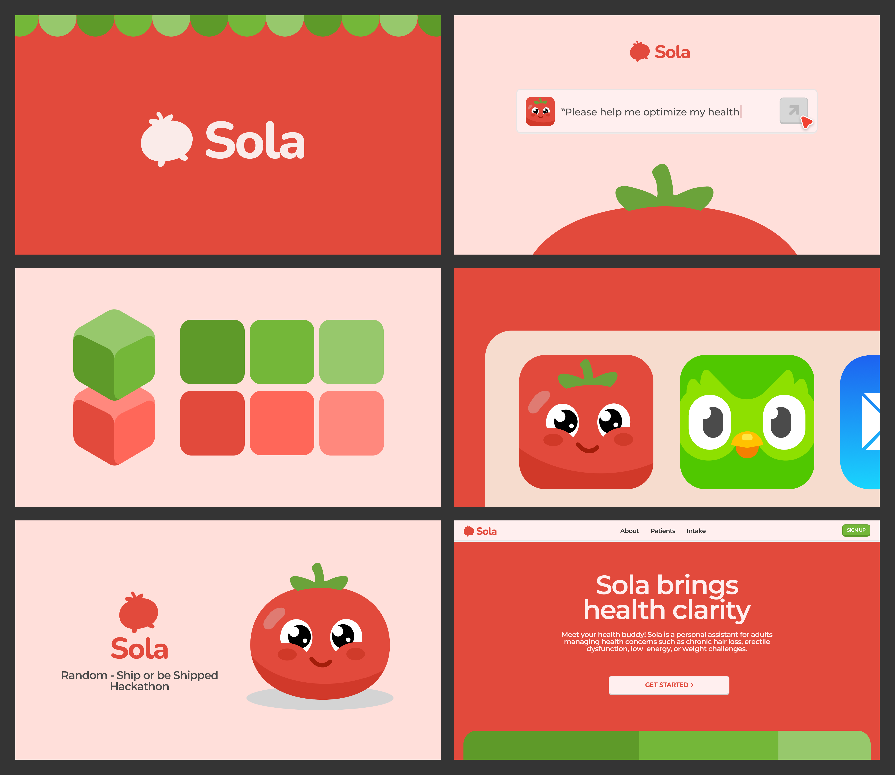

<p align="center">
  <br />
  <a href="https://sola-buddy.vercel.app">
    <picture>
      
    </picture>
  </a>
</p>

# Sola

> **Note**: This project was built and submitted as part of the Ship or be Shipped Hackathon.

Clinical decision support system that bridges structured patient intake and clinician decision-making. It leverages retrieval-augmented generation (RAG) backed by FAISS-based vector similarity search to contextualize patient data against curated medical knowledge, perform automated risk and contraindication analysis, and generate evidence-based treatment plans for clinician review and override.

## Flow

1. **Structured Intake**
   Patient data is collected via a multi-step digital intake.
2. **AI Clinical Analysis**
   Data is processed through a RAG pipeline using FAISS to retrieve relevant medical knowledge, assess risks, and generate treatment suggestions.
3. **Clinician Review**
   Clinicians review, adjust, or override AI outputs with risk classifications.
4. **Approval & Audit**
   Final decisions are approved by clinicians and fully logged for compliance.
5. **Report Output**
   Approved plans are exported as clinical reports (PDF).

## Features

- **Risk Detection**: Automated health risk and conflict alerts.
- **Treatment Guidance**: AI-driven medication and lifestyle recommendations.
- **Clinician Control**: Full review and override insights.
- **Audit Logging**: Complete, compliant change history.
- **Secure Access**: Role-based patient and provider authentication.

## Tech Stack


## Setup

1.  **Environment Variables**: Create a `.env.local` file based on `env.sample`:
    ```env
    NEXT_PUBLIC_SUPABASE_URL=...
    NEXT_PUBLIC_SUPABASE_ANON_KEY=...
    SUPABASE_SERVICE_ROLE_KEY=...
    OPENAI_API_KEY=...
    ```
2.  **Run Development Server**:
    ```bash
    bun install
    bun run dev
    ```


